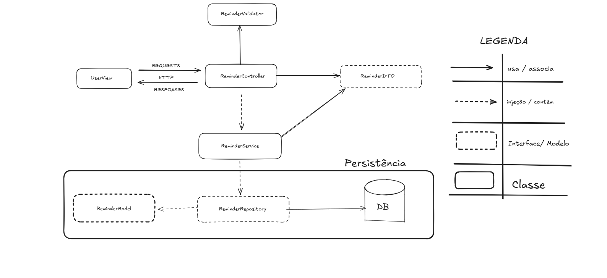
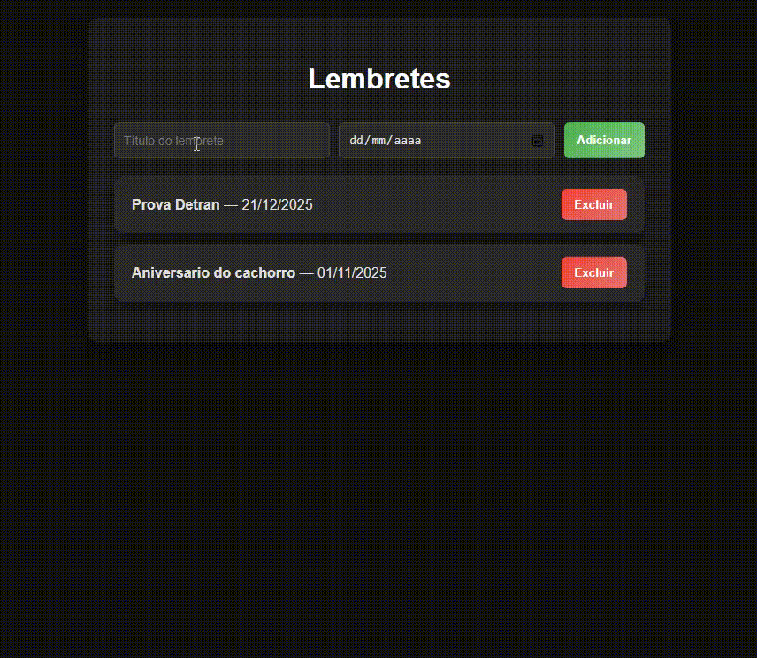
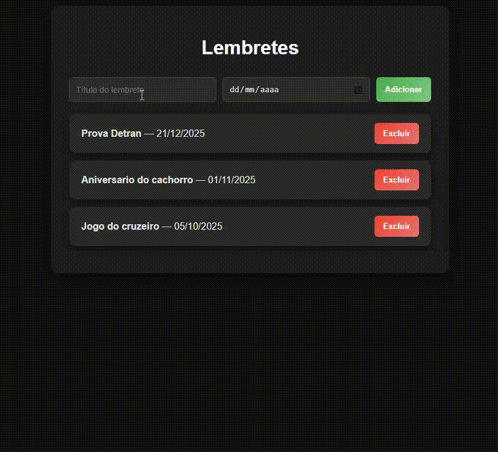
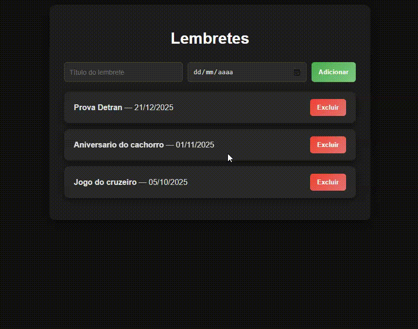

# API para lembretes

Repositório referente a uma **API responsável por gerenciar a criação, listagem e exclusão de lembretes**.  
A API permite que usuários adicionem lembretes com título e data, consultem todos os lembretes cadastrados e excluam lembretes existentes.  
Este projeto foi desenvolvido para testes e aprendizado, e pode ser integrado facilmente com um frontend de sua escolha para visualização e manipulação dos lembretes.

---

## Sumário

- [Instruções para execução do sistema](#instruções-para-execução-do-sistema)  
- [Tecnologias e ferramentas utilizadas](#tecnologias-e-ferramentas-utilizadas)  
- [Arquitetura do projeto](#arquitetura-do-projeto)  
- [GIFs do funcionamento da aplicação](#gifs-do-funcionamento-da-aplicação)  

---

## Instruções para execução do sistema

- Aplicação acessível em: [https://localhost:8080](https://localhost:8080)  
- Documentação da API (Swagger): [http://localhost:8080/swagger-ui/index.html](http://localhost:8080/swagger-ui/index.html)  

Para rodar a API localmente, basta executar a aplicação Spring Boot no seu ambiente de desenvolvimento e garantir que o banco de dados esteja configurado corretamente.

---

## Tecnologias e ferramentas utilizadas

- **Linguagens e Banco de dados**: Java, PostgreSQL  
- **Frameworks e Bibliotecas**: Spring Boot, Spring MVC, Spring Data, Spring Validation  
- **Testes e documentação**: Postman, Swagger  
- **Frontend para testes**: [Reminders Frontend](https://github.com/Henrique20o/reminder-front)  
- **Banco de dados em memória**: H2 Database (para testes unitários futuros)  

---

## Arquitetura do projeto

### Diagrama do projeto

  

### Portas e respostas

| Método HTTP | Endpoint        | Status HTTP para sucesso | Possíveis erros                                               |
|------------|-----------------|------------------------|---------------------------------------------------------------|
| POST       | /reminder       | 201 Created            | 400 Bad Request - Caso data mal formatada ou título inválido |
| GET        | /reminder       | 200 OK                 | -                                                             |
| DELETE     | /reminder/{id}  | 204 No Content         | 404 Not Found - Caso o lembrete não seja encontrado          |

---

## GIFs do funcionamento da aplicação

### Criação de lembrete
  

### Erro ao criar lembrete
  

### Deletando lembrete
  

---
